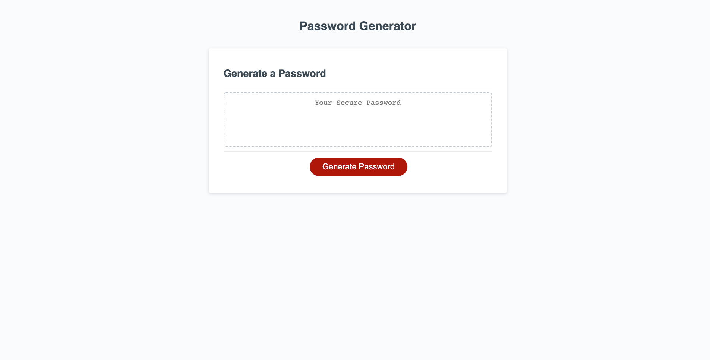

# password-generator

## Project Description

The goal of this project was to create an application that an employee can use to generate a random password based on their password length preferences (8 to 128 characters) and character type preferences (numbers, uppercase letters, lowercase letters, or special characters). HTML and CSS starter code was provided for this project, but it was my job to power the starter code with JavaScript from scratch.

## Challenge #1 - Concatenating Character Type Preferences into an Array

This aspect of the project was incredibly challenging as it tested my problem solving and logical thinking skills. I quickly realized that the way humans think about everyday processes is completely different from the way we need to program computers to think and execute a process for us. After collaboration with peers, guidance from a tutor, studying online resources and utilizing a JavaScript book by Jon Duckett, I was able to figure out how to take the user's character type preferences (boolean values) and concatenate them (a series of strings) into an array. This was an important step in the completion of this project because without this array, I wouldn't have been able to generate a password that meets their character type preferences.

## Challenge #2 - Generating a Random Password using a For Loop

Once I figured out the solution for concatenating the user's character type preferences into an array, I needed to figure out how to take the password length preference and the character type preferences and use those values to generate a random password. The solution that I ended up utilizing was a for loop. Through my research, I found that there were many different ways that this step in the creation of this app could have been executed, but this was what worked for me and where my knowledge of JavaScript was at during the time of this project.

## Conclusion

This was by far the most challenging project that I have been tasked with so far in my web development journey. Before this project, I had very little understading of functions, concatenation, and for loops. Through studying and collaboration with peers, I'm confident that I could teach the fundamentals of this project to another developer.

## Links

[Password Generator App](https://mychalgm.github.io/password-generator/) 
[Repository](https://github.com/mychalgm/password-generator)

## Screenshot

